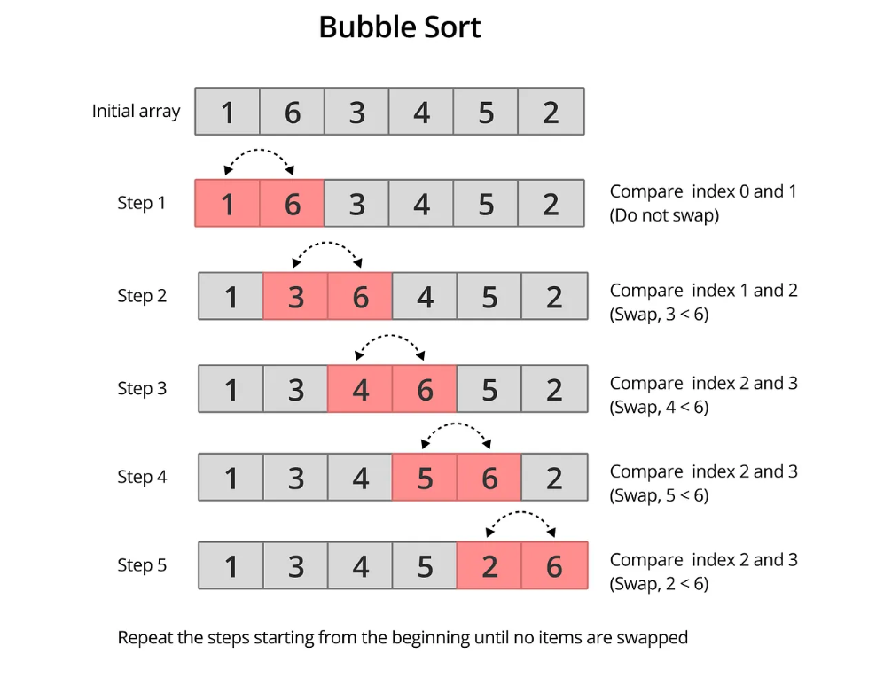

># Bubble Sort Algorithm

## Overview
Bubble Sort is a simple comparison-based sorting algorithm that repeatedly steps through a list, compares adjacent elements, and swaps them if they are in the wrong order. The process continues until no more swaps are needed, indicating the list is sorted.

## How It Works

### Visual Explanation
### Example 1:
- 


## Algorithm Steps:
1. **Start** from the first element (index 0)
2. **Compare** current element with the next element
3. **Swap** if current element > next element
4. **Move** to the next pair of elements
5. **Repeat** until the end of the array
6. **Largest** element "bubbles up" to the end
7. **Reduce** array size by 1 (last element is sorted)
8. **Continue** until no swaps are needed

## Python Implementation

### Basic Implementation
```python
def bubble_sort(arr):
    n = len(arr)
    
    # Outer loop for number of passes
    for i in range(n):
        # Inner loop for comparisons in each pass
        for j in range(0, n-i-1):
            # Compare adjacent elements
            if arr[j] > arr[j+1]:
                # Swap if they are in wrong order
                arr[j], arr[j+1] = arr[j+1], arr[j]
    
    return arr
```


># Time & Space Complexity Comparison : 

| Complexity            | Value         | Explanation                                       |
|-----------------------|---------------|---------------------------------------------------|
| **Best Case**         | `O(n)`        | Array is already sorted (optimized version)       |
|                       |               |                                                   |
| **Average Case**      | `O(n²)`       | Random order                                      |
|                       |               |                                                   |
| **Worst Case**        | `O(n²)`       | Array is sorted in reverse                        |
|                       |               |                                                   |
| **Space Complexity**  | `O(1)`        | In-place sorting, no extra space needed           |
|                       |               |                                                   |


## Pros and Cons
### Advantages
- No extra memory required (in-place sorting)
- Detects if array is already sorted (optimized version)
- Stable sorting algorithm

### Disadvantages
- Very slow for large datasets (`O(n²)`)
- Makes many unnecessary comparisons
- Not suitable for production use on large data

### When to Use Bubble Sort
- Small datasets - Works fine for `n < 100`
- Nearly sorted data - Optimized version is efficient
- When memory is extremely limited - No extra space needed
- When stability is required - Maintains relative order of equal elements
