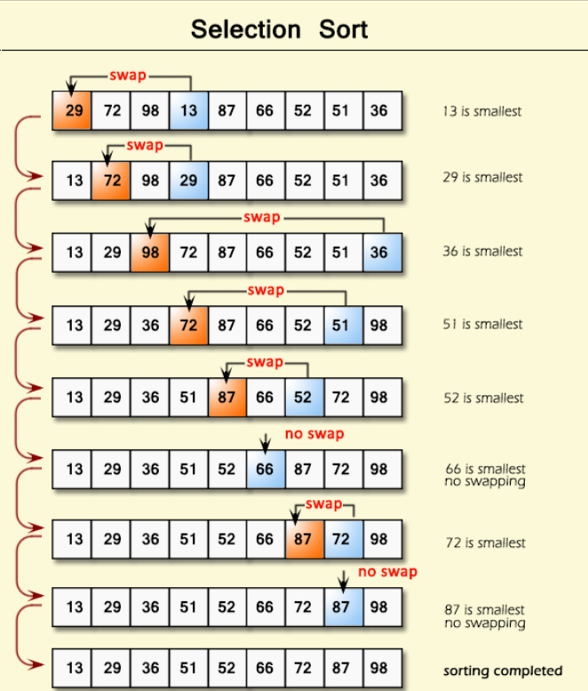

># Selection Sort Algorithm

## Overview
Selection Sort is a simple in-place comparison-based sorting algorithm that divides the input list into two parts: a sorted sublist of items built up from left to right at the front of the list, and an unsorted sublist occupying the rest. The algorithm repeatedly finds the minimum element from the unsorted sublist, swaps it with the leftmost unsorted element, and advances the sublist boundary.

---

## How It Works

### Visual Explanation
### Example 1:
- 

---

## Algorithm Steps:
1. **Start** with the first element of the array (index 0) as the initial minimum
2. **Scan** through the remaining unsorted elements to find the actual minimum element
3. **Compare** each element with the current minimum
4. **Update** the minimum index if a smaller element is found
5. **Swap** the found minimum element with the first element of the unsorted portion
6. **Move** the boundary of the sorted and unsorted portions one step to the right
7. **Repeat** until the entire array is sorted


---

## Python Implementation

### Basic Implementation
```python
def selection_sort(array):
    for i in range(len(array)):
        min_index = i  # Assume current index is the minimum
        
        for j in range(i + 1, len(array)):
            if array[j] < array[min_index]:
                min_index = j  # Update minimum index if smaller element found
                
        # Swap the found minimum element with the first element
        if min_index != i:
            array[i], array[min_index] = array[min_index], array[i]
            
    return array
```

---


># Time & Space Complexity Comparison : 

| Complexity            | Value         | Explanation                                       |
|-----------------------|---------------|---------------------------------------------------|
| **Best Case**         | `O(n²)`       | Always scans array, even if already sorted        |
|                       |               |                                                   |
| **Average Case**      | `O(n²)`       | Random order, performs full scans                 |
|                       |               |                                                   |
| **Worst Case**        | `O(n²)`       | Array is sorted in reverse                        |
|                       |               |                                                   |
| **Space Complexity**  | `O(1)`        | In-place sorting, no extra space needed           |
|                       |               |                                                   |


---

## Pros and Cons:

### Advantages
- No extra memory required (in-place sorting)
- Minimal number of swaps ($\mathcal{O}(n)$ swaps) compared to other algorithms
- Simple and straightforward logic

### Disadvantages
- Very slow for large datasets (`O(n²)`)
- Not adaptive: takes the exact same time even if the list is already sorted
- Unstable sorting algorithm (can change relative order of identical elements)

### When to Use Selection Sort
- Small datasets - Works fine for small n
- When memory is extremely limited - No extra space needed
- When write/swap operations are expensive - Minimizes write operations to the array